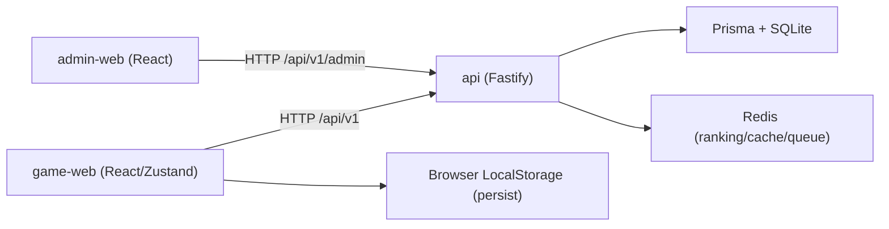

# 万界轮回 C/S 架构评估与改进方案

## 1. 结论（当前是否为客户端+服务端）

当前项目是**前后端分离的混合 C/S 架构**，不是纯本地单机，也不是完整“服务端权威”的 MMO 架构。

- 已具备 C/S 基础：
  - `apps/game-web`：游戏前端
  - `apps/admin-web`：管理后台前端
  - `apps/api`：Fastify + Prisma 服务端
  - `vite.workspace.mjs` 已配置 `/api` 反向代理
- 仍偏客户端主导：
  - 核心玩法状态（修炼/战斗/剧情推进/炼丹/弟子/秘境）主要由前端 Zustand + `persist` 驱动
  - 服务端主要承载账号、社交、运营、排行榜、云存档等能力

因此，当前更准确的定位是：**“客户端演算 + 服务端业务平台 + 云存档”的过渡态架构**。

## 2. 当前拓扑与职责

## 3. 状态权威矩阵（现状）

| 领域 | 当前权威 | 说明 |
| --- | --- | --- |
| 认证/会话 | 服务端 | JWT + refresh token |
| 云存档 | 服务端 | `game_save` 存储完整快照 |
| 社交/宗门/邮件/聊天/市场/PVP | 服务端 | 业务逻辑在 `apps/api` |
| 运营后台（公告/活动/管理） | 服务端 | Admin API |
| 修炼/剧情/战斗/炼丹/弟子/秘境即时状态 | 客户端 | Zustand `persist` 本地驱动 |
| 内容数据（敌人/物品等） | 双源 | 远端 content API + 本地静态 fallback |

## 4. 关键架构风险

1. 核心玩法状态与服务端投影可能漂移。  
2. 未登录场景与登录场景并存，状态口径容易分叉。  
3. API 契约文档与实际实现长期存在漂移风险（手工维护成本高）。  
4. 线上多端同步、反作弊与回放能力不足（客户端演算为主导致）。  

## 5. 本轮已落地改进（2026-04-16）

1. **云存档写入时同步更新玩家主数据投影**  
   - 文件：`apps/api/src/modules/save/save.service.ts`
   - 新增快照解析器：`apps/api/src/modules/save/save.player-projection.ts`
   - 效果：保存存档时会把境界、属性、轮回、战力等可用字段同步到 `player` 表，降低“有存档无投影”的架构断层。

2. **前端 API 基址改为可配置**  
   - 文件：
     - `apps/game-web/src/services/api.ts`
     - `apps/admin-web/src/api/index.ts`
   - `API_BASE` 从硬编码改为 `import.meta.env.VITE_API_BASE || '/api/v1'`，支持前后端独立部署与网关切换。

## 6. 目标架构（建议）

目标是分阶段演进到**服务端权威 + 客户端预测/展示**：

1. P0（已启动）
   - 云存档快照 -> 服务端玩家投影（本轮完成）
   - 前端 API 基址可配置（本轮完成）

2. P1（下一阶段）
   - 增加 `stateRevision` / `updatedAt`，统一冲突策略（LWW 或版本拒绝）
   - 将排行榜更新改为“存档写入后异步触发重算/同步”
   - 关键玩法（至少修炼和战斗结算）改为服务端结算接口

3. P2（稳定阶段）
   - WebSocket 推送玩家状态增量
   - 内容版本化发布（content version）与灰度回滚
   - 审计日志与防作弊规则（关键字段变更轨迹）

## 7. 判定标准（何时可称为完整 C/S）

满足以下条件后，可称“完整客户端+服务端设计”：

1. 核心玩法结算由服务端权威判定。  
2. 客户端仅保留短期缓存与表现层状态，不作为最终真相。  
3. 多端登录同账号可稳定恢复同一服务器状态。  
4. 排行榜、社交、经济数据与玩法状态来源一致。  

